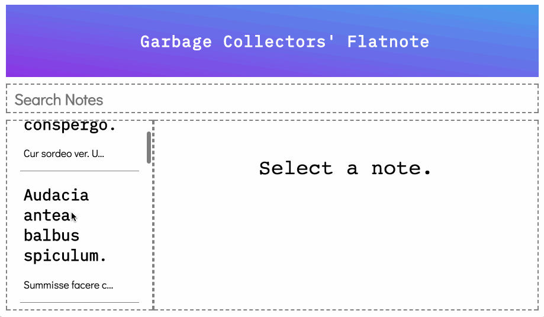
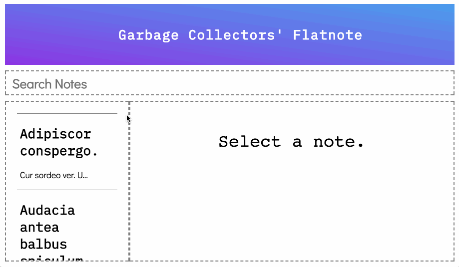
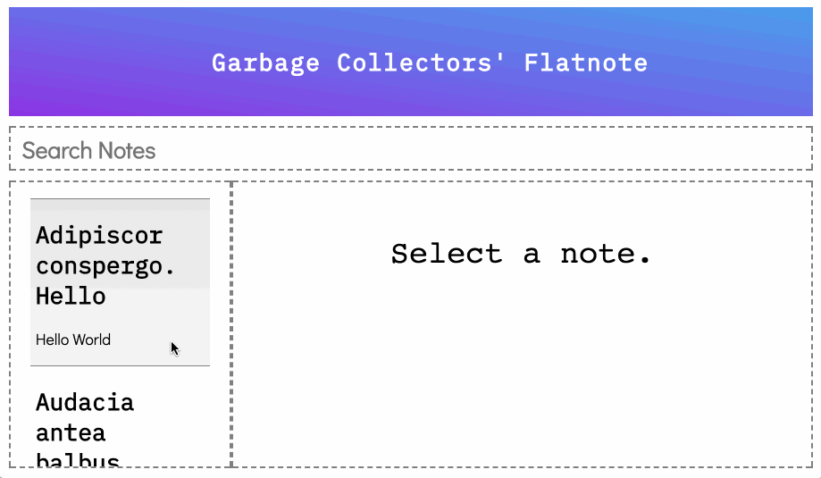
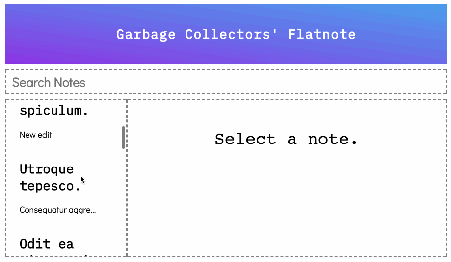

# Welcome to React Evernote
This notes application allows a user to keep track of things that they want to remember and makes these notes easily accessible to find again through the search by title feature, and the sorting features. 

## Project Requirements
    - db.json file storing notes with title, body and id attributes
    - React app running on localhost:4000 & JSON server on localhost:3000
    - Fetch to separate routes (GET '/notes', POST '/notes', PATCH 'notes/:id)

## User Statements
  - Deliverables:
    - As a user I can create a note
    - As a user I can see my notes in the side bar
    - As a user I can edit a note (and save or cancel my edits)
    - As a user I can filter through all my notes by title in the search bar
  - Stretch:
    - As a user I can sort my notes alphabetically, by date created, by date edited
    - As a user I can delte a note

**React**

* All CSS styles are provided for you.
* Many components are provided for you, but most are not completely functional. It is your job to read the code and figure out how to incorporate it into your app.

## Deliverables

Look at the gif below to see how the app should look and behave. These are the baseline deliverables you need to complete:

**Viewing and Displaying Notes**

- [ ] Display all notes in the left sidebar.
- [ ] Displayed sidebar notes should show the title and a truncated body.
- [ ] When clicking a note from the sidebar, display its contents in the right panel.

**Editing Notes**

- [ ] When displaying a note in the right panel, show an `Edit` button.
- [ ] Clicking the `Edit` button will allow the user to edit the title and body in the right panel.
- [ ] When in edit mode, also show a `Save` button which saves the note via a `PATCH` request.
- [ ] When in edit mode, also show a `Cancel` button which discards any changes and reverts back to displaying the note.
- [ ] Clicking a different note while in edit mode should discard your changes and display the new note instead.

**Creating Notes**

- [ ] At the bottom of your left sidebar, show a `New` button.
- [ ] Clicking `New` will create a new note via a `POST` request with some default title and body.
- [ ] This new note should appear in the sidebar.

**Filtering Notes**

- [ ] Implement the filter to search through your notes list by title.

## Stretch Goals

When you are finished with the *Delieverables*, you can build out any new features that you want. This is your chance to be creative and make your project unique!

Some suggestions:

- Add the ability to filter by body, date created, date edited, etc.
- Sorting by date created, date edited, alphabetical, etc.
- Use `react-router` to create a multi-page app
- Rich text formatting
- Tagging
- Emailing notes

